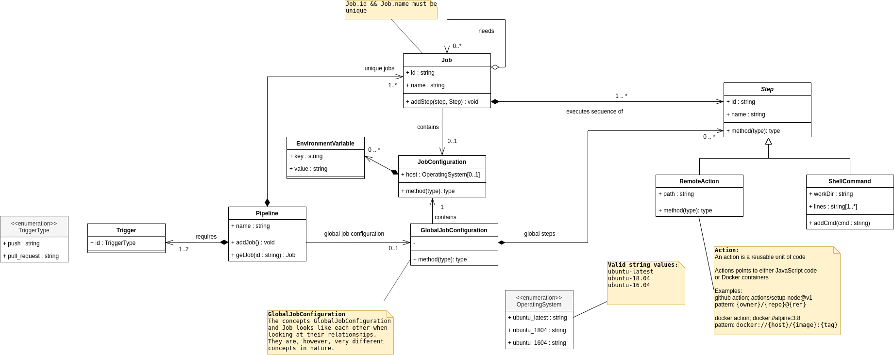

# Github Actions internal DSL
This repository contains an internal DSL (written in C#) for creating pipelines with Github Actions (https://github.com/features/actions).

The development of the internal DSL was part of an assignment for the Master's course, Model-Driven Software Development, in the Software Engineering program at University of Southern Denmark.


# Purpose of the DSL
This internal DSL aims to make it easier to make Github Action pipelines and to enhance on the features.

Added features which is not available in Github actions:

* Global Steps - makes it possible to create steps that are prepended to all defined jobs. This means that instead of writing trivial steps for each job (for instance 'checkout').

* Global operating system - makes it possible to make all jobs use a specific OS by defining it once in a global section.

* Global environment variables - makes it possible to set environment variables on all jobs.

Individual jobs makes it possible to override the global settings.

# What does the DSL do
The DSL builds a meta model instance of a pipeline and uses this instance to generate YAML output, which can be executed by the Github actions environment.

# Limitations
It is important to notice that there are some limitations to the DSL. This means that the DSL does not (yet) fully implement the specification of the Github actions API. In an ideal world the meta model should be abstracted to a level where the meta model is independent of the underlying platform. This is remains an usolved challenge because there is no standard definition of what concepts that constitutes an automated pipeline.  

# Demonstration


## Example 1
This repository contains a game named TANKS written in Java. The process of building this game can be automated with a pipeline for Github actions.

The program written in the internal DSL should be self-explanatory to users that have a background in Computer Science, Software Engineering or similar. It is recommended to have some knowledge of C#, Maven and *nix systems.

### Generating the meta model instance

```C#
IPipelineBuilder builder = new PipelineBuilderImpl();

string workDir = "./TANKS";

builder.Pipeline("myPipeline").
// Global section
    TriggerOn(TriggerType.Push).
    AddGlobals().
        RunsOn(OperatingSystem.UbuntuLatest).
        SetEnvVar("MY_ENV_VAR", "HELLO WORLD!").
        AddStep("Default Checkout step").
            AsAction().
                Execute("actions/checkout@v2").
        AddStep("Default clean step").
            AsShell().
                Execute("echo \"My Global Job\"").
                Execute("echo \"Value of global env var: \" $MY_ENV_VAR").
                Execute("mvn clean").
                InDirectory(workDir).

// Individual jobs
    AddJob("compile").
        SetName("Compile").
        AddStep("Compile Step").
            AsShell().
                Execute("mvn compile").
                InDirectory(workDir).
    AddJob("unit-test").
        SetName("Unit test").
        RunsOn(OperatingSystem.Ubuntu1604).
        DependsOn("compile").
        AddStep("Unit Test Step").
            AsShell().
                Execute("mvn verify").
                InDirectory(workDir).
    AddJob("package").
        SetName("Package").
        RunsOn(OperatingSystem.Ubuntu1804).
        DependsOn("unit-test").
        SetEnvVar("MY_ENV_VAR", "HELLO FYN").
        SetEnvVar("LOCAL_VAR", "HELLO ODENSE").
        AddStep("Maven package").
            AsShell().
                Execute("mvn package").
                Execute("echo \"Value of overridden global env var: \" $MY_ENV_VAR").
                Execute("echo \"Value of local env var: \" $LOCAL_VAR").
                InDirectory(workDir).
    AddJob("install").
        SetName("Install").
        DependsOn("package").
        AddStep("Maven install").
            AsShell().
                Execute("mvn install").
                InDirectory(workDir);

builder.Build();
pipeline = builder.Collect(); // Get the model instance
```

### Generating the YAML output
The model can then be used to generate code as shown below:

```C#
PipelineCodeGen codeGen = new PipelineCodeGen(pipeline); // Use the meta model instance
string YAML = codeGen.Generate();

// It is possible to customize the indentation of the YAML output
codeGen.Indent = 4;
YAML = codeGen.Generate();
```

The output is shown in YAML below with default 2 indentations followed by an example of 4 indentations:

```YAML
DSLTests.CodeGenTests.YAMLGeneratorTest.GenerateYAML2

name: myPipeline

on: [push]

jobs:

  compile:
    name: Compile
    runs-on: [ubuntu-latest]
    env: 
      MY_ENV_VAR: "HELLO WORLD!"
    steps:
      - uses: actions/checkout@v2
        name: Default Checkout step
      - name: Default clean step
        working-directory: ./TANKS
        run: |
          echo "My Global Job"
          echo "Value of global env var: " $MY_ENV_VAR
          mvn clean
      - name: Compile Step
        working-directory: ./TANKS
        run: mvn compile
  unit-test:
    name: Unit test
    runs-on: [ubuntu-16.04]
    needs: [compile]
    env: 
      MY_ENV_VAR: "HELLO WORLD!"
    steps:
      - uses: actions/checkout@v2
        name: Default Checkout step
      - name: Default clean step
        working-directory: ./TANKS
        run: |
          echo "My Global Job"
          echo "Value of global env var: " $MY_ENV_VAR
          mvn clean
      - name: Unit Test Step
        working-directory: ./TANKS
        run: mvn verify
  package:
    name: Package
    runs-on: [ubuntu-18.04]
    needs: [unit-test]
    env: 
      MY_ENV_VAR: "HELLO FYN"
      LOCAL_VAR: "HELLO ODENSE"
    steps:
      - uses: actions/checkout@v2
        name: Default Checkout step
      - name: Default clean step
        working-directory: ./TANKS
        run: |
          echo "My Global Job"
          echo "Value of global env var: " $MY_ENV_VAR
          mvn clean
      - name: Maven package
        working-directory: ./TANKS
        run: |
          mvn package
          echo "Value of overridden global env var: " $MY_ENV_VAR
          echo "Value of local env var: " $LOCAL_VAR
  install:
    name: Install
    runs-on: [ubuntu-latest]
    needs: [package]
    env: 
      MY_ENV_VAR: "HELLO WORLD!"
    steps:
      - uses: actions/checkout@v2
        name: Default Checkout step
      - name: Default clean step
        working-directory: ./TANKS
        run: |
          echo "My Global Job"
          echo "Value of global env var: " $MY_ENV_VAR
          mvn clean
      - name: Maven install
        working-directory: ./TANKS
        run: mvn install
```

Same meta model instance with 4 space indentations:

```YAML
name: myPipeline

on: [push]

jobs:

    compile:
        name: Compile
        runs-on: [ubuntu-latest]
        env: 
            MY_ENV_VAR: "HELLO WORLD!"
        steps:
            - uses: actions/checkout@v2
              name: Default Checkout step
            - name: Default clean step
              working-directory: ./TANKS
              run: |
                  echo "My Global Job"
                  echo "Value of global env var: " $MY_ENV_VAR
                  mvn clean
            - name: Compile Step
              working-directory: ./TANKS
              run: mvn compile
    unit-test:
        name: Unit test
        runs-on: [ubuntu-16.04]
        needs: [compile]
        env: 
            MY_ENV_VAR: "HELLO WORLD!"
        steps:
            - uses: actions/checkout@v2
              name: Default Checkout step
            - name: Default clean step
              working-directory: ./TANKS
              run: |
                  echo "My Global Job"
                  echo "Value of global env var: " $MY_ENV_VAR
                  mvn clean
            - name: Unit Test Step
              working-directory: ./TANKS
              run: mvn verify
    package:
        name: Package
        runs-on: [ubuntu-18.04]
        needs: [unit-test]
        env: 
            MY_ENV_VAR: "HELLO FYN"
            LOCAL_VAR: "HELLO ODENSE"
        steps:
            - uses: actions/checkout@v2
              name: Default Checkout step
            - name: Default clean step
              working-directory: ./TANKS
              run: |
                  echo "My Global Job"
                  echo "Value of global env var: " $MY_ENV_VAR
                  mvn clean
            - name: Maven package
              working-directory: ./TANKS
              run: |
                  mvn package
                  echo "Value of overridden global env var: " $MY_ENV_VAR
                  echo "Value of local env var: " $LOCAL_VAR
    install:
        name: Install
        runs-on: [ubuntu-latest]
        needs: [package]
        env: 
            MY_ENV_VAR: "HELLO WORLD!"
        steps:
            - uses: actions/checkout@v2
              name: Default Checkout step
            - name: Default clean step
              working-directory: ./TANKS
              run: |
                  echo "My Global Job"
                  echo "Value of global env var: " $MY_ENV_VAR
                  mvn clean
            - name: Maven install
              working-directory: ./TANKS
              run: mvn install

```

## Example 2
This is a very simplified and minimized example of using the DSL. It does contain a global configuration but does not make use of overriding and dependencies.

### Generating the meta model instance

```C#
IPipelineBuilder builder = new PipelineBuilderImpl();
            
builder.Pipeline("myPipeline").
    TriggerOn(TriggerType.Push).
    AddGlobals().
        RunsOn(OperatingSystem.UbuntuLatest).
        SetEnvVar("MY_ENV_VAR", "HELLO WORLD!").
        AddStep("Default Checkout step").
            AsAction().
                Execute("actions/checkout@v2").
        AddStep("Default clean step").
            AsShell().
                Execute("echo \"My Global Job\"").
                Execute("mvn clean").
                InDirectory("./TANKS").
    AddJob("compile").
        AddStep("Compile Step").
            AsShell().
                Execute("mvn compile").
                InDirectory("./TANKS").
    AddJob("unittest").
        AddStep("Unit Test Step").
            AsShell().
                Execute("mvn verify").
                InDirectory("./TANKS");

builder.Build();
pipeline = builder.Collect(); // Creates the meta model instance
```

### Generating the YAML output

```C#
PipelineCodeGen codeGen = new PipelineCodeGen(_pipeline);
string YAML = codeGen.Generate();
```


YAML output:
```YAML
name: myPipeline

on: [push]

jobs:

  compile:
    name: efc646e7-a619-4991-9752-53b61ba96eea
    runs-on: [ubuntu-latest]
    env: 
      MY_ENV_VAR: "HELLO WORLD!"
    steps:
      - uses: actions/checkout@v2
        name: Default Checkout step
      - name: Default clean step
        working-directory: ./TANKS
        run: |
          echo "My Global Job"
          mvn clean
      - name: Compile Step
        working-directory: ./TANKS
        run: mvn compile
  unittest:
    name: 0c88aeb2-6426-4fcf-acd3-15c098b36907
    runs-on: [ubuntu-latest]
    env: 
      MY_ENV_VAR: "HELLO WORLD!"
    steps:
      - uses: actions/checkout@v2
        name: Default Checkout step
      - name: Default clean step
        working-directory: ./TANKS
        run: |
          echo "My Global Job"
          mvn clean
      - name: Unit Test Step
        working-directory: ./TANKS
        run: mvn verify
```

# Metal model class diagram UML

