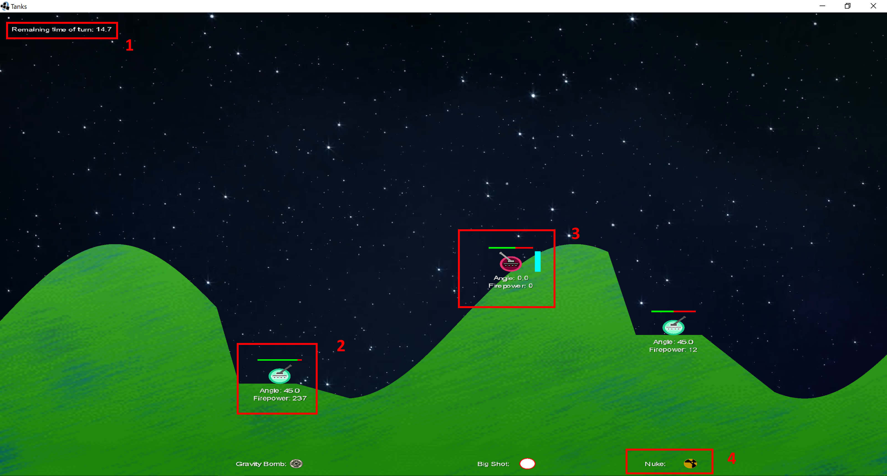
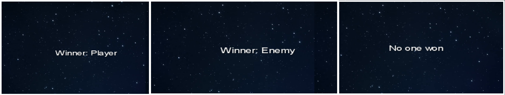
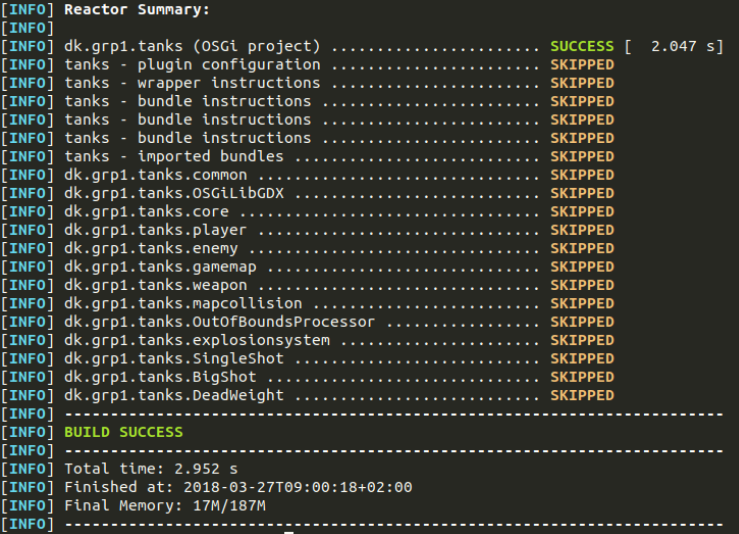
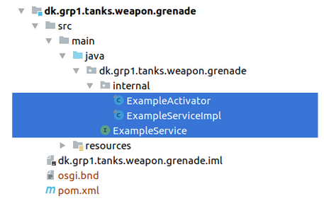
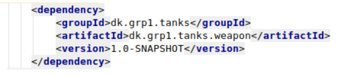
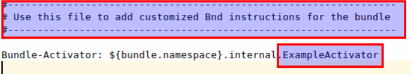

# TANKS (Tactical Artillery Nuclear Killers in Space)
The idea for 4th semester project was a turn-based artillery game. The game is inspired by the “Worms” series of games and the online flash game “TANKS”. Players will take turns firing a wide variety of weapons towards their enemies in order to destroy each other. The game contains simple AI controlled enemies and a simple homing missile that uses an implementation of the A* (A-star) algorithm.


# Requirements
* Maven 3.6.1
* JDK8

# Demo
A demo of TANKS can be found in *guides/Demo.mp4*.

# How to build and run TANKS
**NB! Use the development branch since the master branch is not up-to-date.**

Open a shell and navigate to the parent folder. Execute the following command:
```
mvn clean install pax:provision
```

## How to skip tests
```
mvn clean install -DskipTests pax:provision
```

## How to build a single bundle / component
Open a shell and navigate to the bundle folder.  Execute the following command:
```
mvn clean install
```

## How to run TANKS without rebuilding each time
Open a shell and navigate to the parent folder.  Execute the following command:
```
mvn pax:provision
```

# How to play TANKS
When the game is started, the game window is shown in the middle of the screen.  The window can be re-sized if desired.  The red numbered boxes in the window represent the following elements:
1. Remaining time of turn shows how much time is left of either the player- or enemy’s turn.
2. Enemy is visualized by a light blue tank.  Above the tank the health-bar of the entity is shown. The angle at which the cannon is aiming and the firepower of the last shot are shown below the tank.
3. Player is visualized by a red tank.  A firepower indicator, which increases with the amount of firepower is shown to the right of the unit.  The health-bar of the entity is shown above the tank.  The angle at which the cannon is aiming and the firepower of the last shot are shown below the tank.
4. Weapon is shown directly below each entity, Player and Enemy, and shows which weapon is currently in use.

**Game window at startup:**



Initially, the game spawns two enemies and a player that is controlled  by user-input from the keyboard. The key bindings are listed in the table below.

| Key   | Action                                                                                  |
|-------|-----------------------------------------------------------------------------------------|
| LEFT  | Move the tank in the left direction                                                     |
| RIGHT | Move the tank in the right direction                                                    |
| DOWN  | Move the cannon in clockwise direction                                                  |
| UP    | Move the cannon in counterclockwise direction                                           |
| SPACE | Increase/decrease the firepower while held down. Fire the cannon upon releasing the key |
| 1     | Shift to the previous weapon                                                            |
| 2     | Shift to the next weapon                                                                |
| R     | Restart the game. Can only be pressed when the game is over.                            |


A tank dies when the health-bar has reached zero  health-points or if the tank is moved out of the game window’s left or right boundary. Each tank takes turns and the game ends when there is only one player or enemy tank left. There are three possible outcomes of ending the game. Either the player wins, the enemy wins or no one wins. The last option occurs if both the player and enemy entities die simultaneously.

**Game end screen:**


# Development of new Weapons for the game
In this guide the creation of the grenade weapon will be documented as a how-to.

## Creating a weapon component
Run the following cmd with the desired name of the bundle from the parent directory:

```
mvn pax:create-bundle “-Dpackage=dk.grp1.tanks.weapon.grenade” “-Dname=grenade-bundle” “-Dversion=1.0-SNAPSHOT”
```
*NB! If you run linux or macOS, remove the double quotes.*

After the command has been run, the following output should be displayed:



## Preparing the weapon component for OSGi registration

1. Delete all the generated classes



2. Add a dependency on the weapon module



3. Create an Activator class implementing the BundleActivator in the internal folder.
4. Edit the osgi.bnd file  to point at the new activator class. Remember to delete the header of the file.



Adding the following line to the .bnd file will add the "weapon"-category to the bundle:

`Bundle-Category: weapon`

NB! The internal folder is used for private packages. If package is desired to be public, it should be outside the folder. The setting is set in the shared plugin settings. (poms/compiled/pom.xml)

5. Create a class implementing the IWeapon interface
6. Create a class implementing the IGamePlugin interface
    
    6.1 Remember to remove all instances of the new weapon in the stop method.

    6.2 Remember to add and remove the IWeapon in gamedata

```java
public class GrenadePlugin implements IGamePluginService {
   private final IWeapon weapon = new GrenadeWeapon();
   @Override
   public void start(World world, GameData gameData) {
       gameData.addWeapon(weapon);
   }

   @Override
   public void stop(World world, GameData gameData) {
       gameData.removeWeapon(weapon);
       for (Entity e : world.getEntities(Grenade.class)) {
           world.removeEntity(e);
       }
   }
}

```

7. Create a class extending the projectile class from the Weapon module
8. Register the implementing IGamePlugin class to the bundle context

```
@Override
public void start(BundleContext bundleContext) throws Exception {
   bundleContext.registerService(IGamePluginService.class.getName(), new GrenadePlugin(), null);
}
```

9. Write a sout in the format below for the stop method in the activator class

```
@Override
public void stop(BundleContext bundleContext) throws Exception {
   System.out.println( "STOPPING dk.grp1.tanks.weapon.Grenade" );
}
```

## Extended Behavior
When creating the the IWeapon implementation, the behavior from the common module will be available. This behavior can also be extended by creating a new or extended EntityParts. For more inspiration, look at the other weapon implementations.

## Easy setup using the weapon generator tool
Run the *dev-tools/WeaponGenerator.jar* file in a shell with the following command:

```
java -jar .\WeaponGenerator.jar NameOfTheNewWeapon
```

NB! It is required to have MAVEN_HOME set as a environment variable for the application to work. When the application is done, the new bundle and required files are created with a hint on how to set up common behavior.
